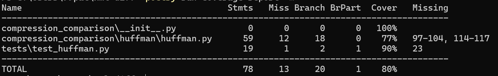

# Viikkoraportti 2

## Työaika

7.5h

## Mitä olen tehnyt tällä viikolla?

Joudun vaihtamaan alkuperäisen projektin aiheen XML-Diff algoritmistä -> Lempel-Ziv-Welch (LZW) - ja Huffman-koodauksen pakentointi vertailu projektiksi.
Viikko meni päänsääntöisesti aiheen lukemisesta ja ensimmäisen Huffman-koodauksen version teossa. Projektiin on siis laadittu ensimmäinen toteutus Huffmanin koodauksesta sekä syötteen luku tiedoston pakkaamiseen/purkaamiseen (encoding & decoding). Myös pari yksenkertaista testiä luotu.

## Miten ohjelma on edistynyt?

Toteutin Huffmanin ensimmäinen toteutuksen sekä syötteen lukemisen/pakkaamisen/purkaamisen.

## Mitä opin tällä viikolla / tänään?

Opin miten tiedon pakkaus yleisesti toimii ja erityisesti miten Huffman koodaus toimii. (Vielä on epäselvyyksiä toiminnan kannalta)

## Mikä jäi epäselväksi tai tuottanut vaikeuksia?

Huffmanin koodaus ja LZW algoritmit eivät ole vielä täysin tuttuja ja ongelmia oli (ja on) käyttöliittymän toteuksen kanssa, liittyen toteus tapaan.

## Mitä teen seuraavaksi?

- Luen lisää materiaalia Huffmanin koodauksesta ja korjaan mahdollisia virheitä.
- Alan työstämään ja lukemaan miten Lempel-Ziv-Welch (LZW) toimii ja tulisi toteuttaa.

## Viikon 2 Testikattavuus

